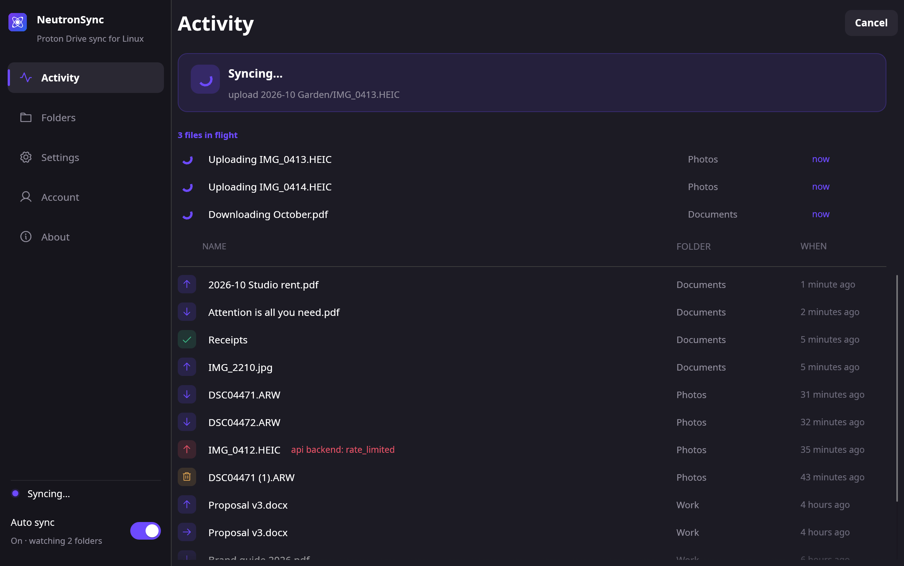
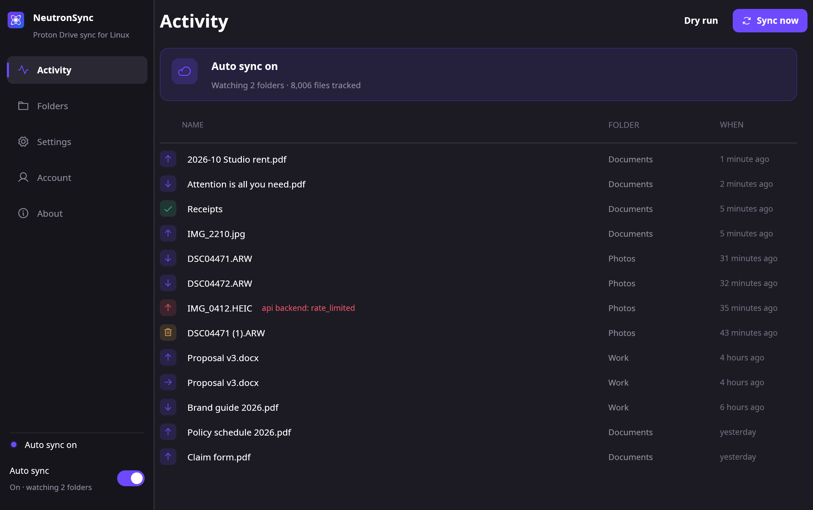
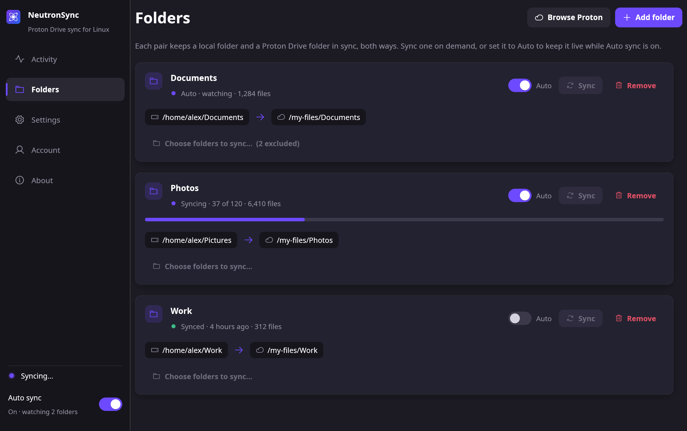
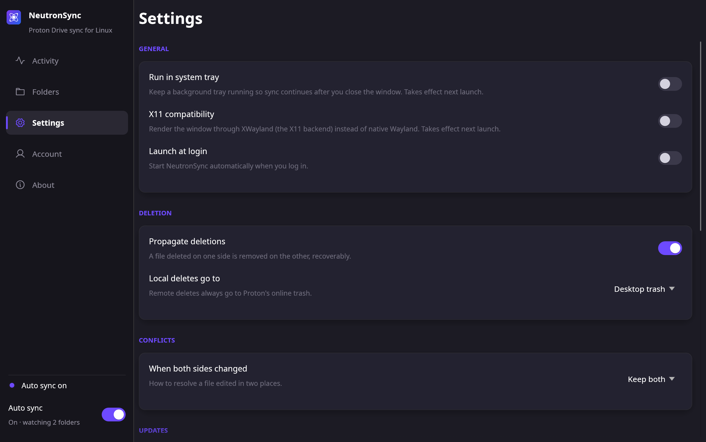
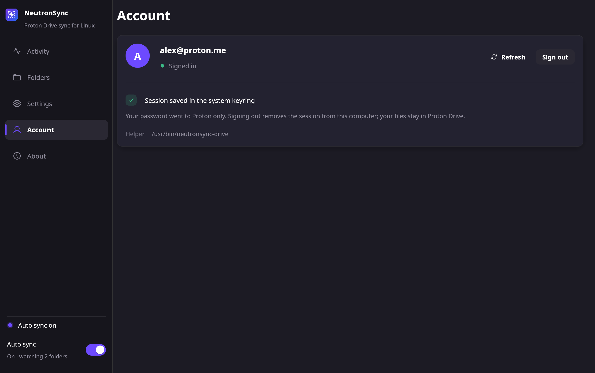
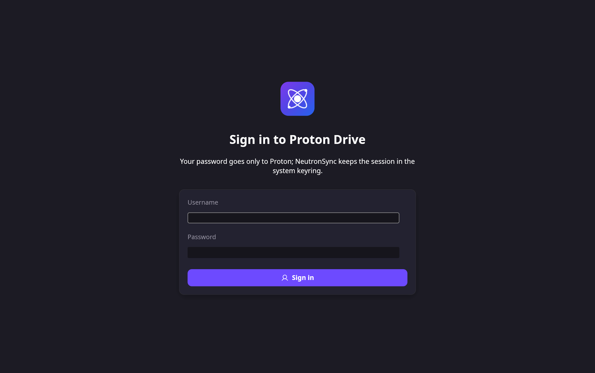
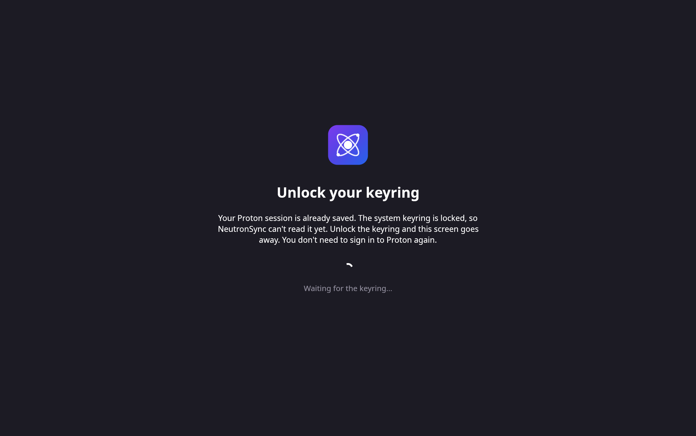

# Screenshots

Every page of the NeutronSync desktop app, captured from the app itself with example folders, files and an example account. Nothing here is a real Proton account or a real file.

Images are rendered at 2x (2048 × 1284 pixels for a 1024 × 642 window) so they stay sharp on high-density displays.

## Activity

The home page. A banner states what the app is doing right now; below it, files in flight and the recent feed of uploads, downloads, moves and deletes, each with the folder pair it belongs to and when it happened. A failed operation shows its reason on the row.



With Auto sync on and nothing in flight, the banner reports what is being watched and how many files are tracked.



## Folders

One card per folder pair: the local folder, the Proton Drive folder, its current state and file count, an Auto switch for live sync, a Sync button for a one-off run and the selective-sync picker. A pair that is syncing shows a progress bar.



## Settings

Grouped cards for tray, X11 compatibility, launch at login, deletion policy, conflict handling, updates and the advanced backend options.



## Account

The signed-in Proton account, where the session is kept and which helper is serving the app, with Refresh and Sign out.



## Sign in

Shown instead of the app when there is no Proton session. Username and password go to Proton only; the session is then saved in the system keyring. Proton may follow up with a two-factor code, a mailbox password or a human-verification page, and the card changes to that step.



## Keyring locked

The session is saved but the system keyring is locked, for example right after logging in to the desktop. The app waits rather than asking you to sign in again, and continues on its own when the keyring is unlocked.



## Regenerating

```sh
scripts/screenshots.sh            # build the GUI and capture into docs/screenshots/
scripts/screenshots.sh --no-build # reuse target/release/neutronsync-gui
```

The script runs `neutronsync-gui --screenshots <dir>` under `xvfb-run` with `HOME` and the XDG directories pointed at a scratch folder, so it never reads your config, your state or your running sidecar. The scenes and example data live in `src/bin/gui.rs` next to `demo_scenes()`.
